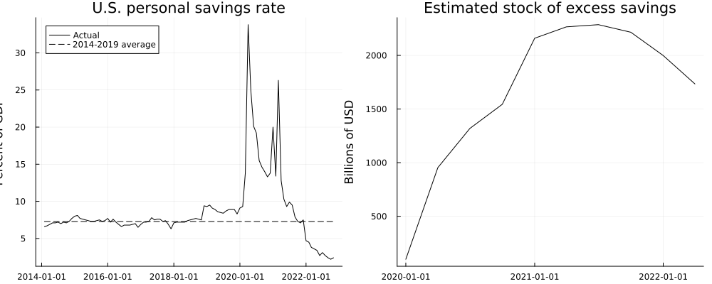
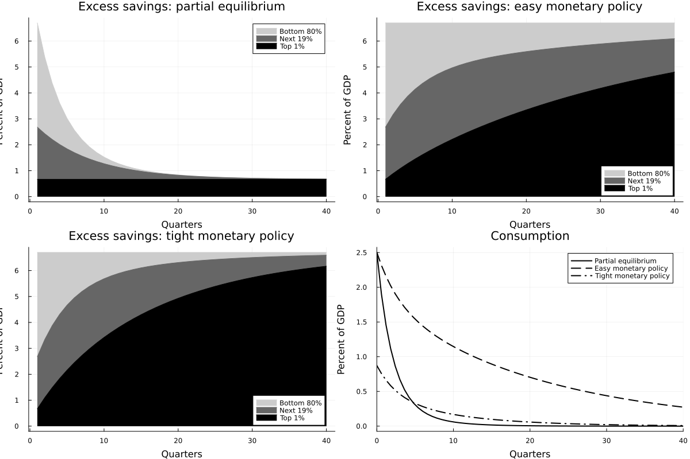

# Trickling_up

[](https://Martin-Bernstein.github.io/Trickling_up.jl/dev/)
[](https://github.com/Martin-Bernstein/Trickling_up.jl/actions/workflows/CI.yml?query=branch%3Amain)


This is a replication kit for the paper
- Auclert, Adrien, Matthew Rognolie, and Ludwig Straub. 2023, "The trickling up of Excess Savings." AEA Papers and Proceedings, 2023.

The paper provides a model that helps understand observed patterns in US savings behavior since the Covid pandemic: because of the US' regressive tax system, stimulus payments made to poorer Americans eventually "trickle up" to the rich. The model studies factors that affect this trickling up.

The original replication kit is included in [auclertoriginal](auclertoriginal).
I replicate Figures 1 and 4 (figures 2 and 3 are author illustrations) and Table 1 from the manuscript [here](auclertoriginal/tricklingup.pdf). 

The original scripts that I translate into Julia are [this](auclertoriginal/replication/Figure1.py), [this](auclertoriginal/ct_re_solver.py), and [this](auclertoriginal/trickling_up_model.py).

The mathematical background of the model simulation functions are described in my [package documentation](https://martin-bernstein.github.io/Trickling_up.jl/dev/).

**There are two ways to run my replication**: from this repository, using software installed on your machine; or via a Docker container. (If you are unfamiliar with Docker, replicating via the Docker container allows you to run the project on a virtual machine configured with all of the necessary software.)

This readme will explain steps first for replication using this repository, and second using the docker container.

# Replicating from this repository

## Software requirements
1. `julia` (version 1.9 was used for this) which can be downloaded [here](https://julialang.org/downloads/)
2. `latexmk` is needed to compile .tex files produced during replication into .pdf files. This is part of the standard TeXLive distribution, available [here](https://www.tug.org/texlive/)
3. Replication should work on recent mac and windows OS. I conducted replication on an M1-chip mac OS 12.6.3; as the green `passing` badge above shows (click on it for more), the package also compiles and runs successfully on the latest intel-chip macs and on the latest windows.
4. (optional) `git` if you would like to replicate by cloning this repository. Otherwise, you can just download the repo as a .zip file.
## Replication instructions

1. Git users: choose a folder where you would like to save this repository. I'll notate it `path/to/pkg`.
Type and run the following in your terminal.
```
cd "/path/to/pkg"           #Folder where you will save the file
git clone "https://github.com/Martin-Bernstein/Trickling_up.jl"
```
Non-git users, download and save this repository into your desired folder (I'll call it `path/to/pkg`).

2. Type and run the following in terminal:
```
julia                       #Start the Julia REPL
julia> cd("/path/to/pkg")   #Navigate to the location of the package repository on your machine
julia> using Pkg           
julia> Pkg.activate(".")    #Activate the package
julia> Pkg.instantiate()    #Install necessary files
julia> include("run.jl")    #Execute replication
```

3. The above will output the table and figures to `/path/to/pkg/output`.
You can check that the files `figure1.pdf`,`figure4.pdf`, `table1.tex`, and `table1.pdf` have been newly written into the `output` folder.
You can check that they correspond to the figures in the original paper [here](auclertoriginal/tricklingup.pdf).

# Replicating with the docker container
The docker image for this project is available on DockerHub and is called martinbernstein/trickling-up-docker. The steps below describe how to run a contained from this project and view its output. (If you are familiar with Docker, the [`Dockerfile`](Dockerfile) in this repository was used to construct the Docker image.)

## Software requirements
1. `Docker` in order to access and run the container. Download the latest version of Docker desktop [here](https://www.docker.com/products/docker-desktop/).

## Replication using the command line

1. "Pull" the Docker container from DockerHub: in a terminal, run
    ```
    docker pull martinbernstein/trickling-up-docker:latest
    ```
2. Run the Docker container by typing the code below into terminal. The Docker container will write tables and figures to an output folder. You can specify where on your machine you would like this output folder to live, by replacing `/desired/outputfolder` with your desired file path. The rest of the code should be typed in as is:

    ```
    docker run -it --rm -v /desired/outputfolder:/app/output martinbernstein/trickling-up-docker
    ```

Errors may appear in your console; these are because the compilation of the .tex tables is leading the Docker container to attempt to open the pdfs, which it cannot do. Ignore these errors, they do not affect replication.

3. Check that the figures and tables in your `/desired/outputfolder` are as in the [original manuscript](auclertoriginal/tricklingup.pdf).

The downside to this replication technique is that the container is entirely opaque: you cannot see what I am doing to replicate the paper. You can look inside the container by instead using Docker desktop, following the steps below.

## Replication using Docker desktop
1. Open Docker desktop. Search for "trickling-up-docker" in the search bar at the top (which you can also open with command-K). Search in the "images" tab.
2. Select the `martinbernstein/trickling-up-docker` image. Click `Run`. Under optional settings, you can optionally name the container and assign a local host; click `Run` again when done.
3. The container will begin to run. The `Logs` tab will open by default. It may show errors; this does not mean that the container is not running successfully. Navigate instead to the `Files` tab.
4. Open the `app` directory in the `Files` tab. Here, you can view the code contained in the Docker container (i.e., the `.jl` files in this directory). You can verify that they are the same as the code in this repository.
5. Once the container has run, replicated tables and figures will be in the `/app/output` directory. You can verify that the "Last modified" will be the time at which you ran the container. To view these files, control-click on them and select `save`. You can then save the replication output and verify that it matches the [manuscript](auclertoriginal/tricklingup.pdf).

# Replication output and explanation
The replication instructions above describe how to view replication output. Here I'll include the output of the latest replication run in this repo for convenience.

### Figure 1
This figure shows savings dynamics during the Covid pandemic. The left panel indicates that due to shutdowns and stimulus payments, savings initially spiked as consumption dropped. Then households "spent down" their excess savings afterwards. The right panel shows the aggregate effect of this behavior on the stock of excess savings.


### Figure 4
This figure is the main result of the paper. The paper writes a continuous time heterogeneous agent model with \$N\$ types of households, indexed by \$i\$. These are thought of as houses with different levels of wealth. Motivated by empirical results, the authors assume that less wealthy households have higher marginal propensities to consume. Agents own assets on which they receive interest. The authors start from a version of the model linearized around the steady state:
```math 
c_{it}=m_ia_{it} \hspace{1cm}\dot{a}_{it}=\theta_tY_t-c_{it}\hspace{1cm}
Y_t=\sum_{i=1}^Nc_{it}
```
where \$\\theta_i\$ is household \$i\$'s share in national income and \$m_i\$ is the MPC out of assets and the other variables are as usual in macro models. The authors focus on the case where \$N=3\$, interpreting these as "poor and middle class" (bottom 80\%), "upper middle class" (next 19\%) and "ultra-rich" (top 1%) groups. They solve for the dynamics of excess savings and consumption via the dynamic system of linear equations from the above equation. They then calibrate the model using US data, and simulate the dynamics of excess savings over time.

The partial and general equilibrium results of this simulation are the top two panels of figure 4. Savings trickle up to the top 1\% after about 3 years.

The authors then extend the model to include rational expectations and monetary policy. The resulting simulation is the bottom left panel of figure 4. Tight monetary policy speeds up the trickling up process.

Finally, the bottom right panel plots the paths of consumption under each of the three models.



### Table 1
[Table 1](output/table1.pdf) displays the duration of output and excess savings. The "duration" of a variable \$X_t\$ is defined as \$\\int tX_tdt / \\int X_tdt\$. It quantifies the differences between the models shown in figure 4, as well as in several alternative model calibrations.

